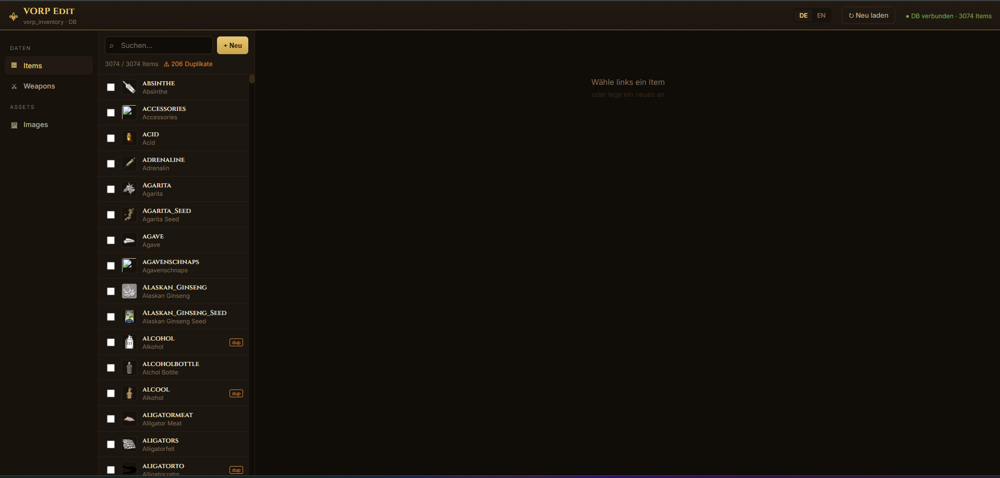
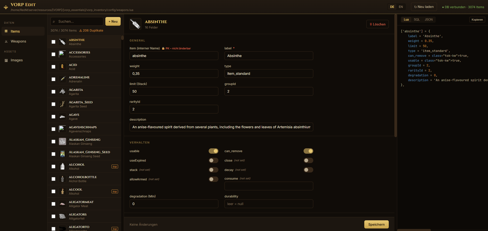
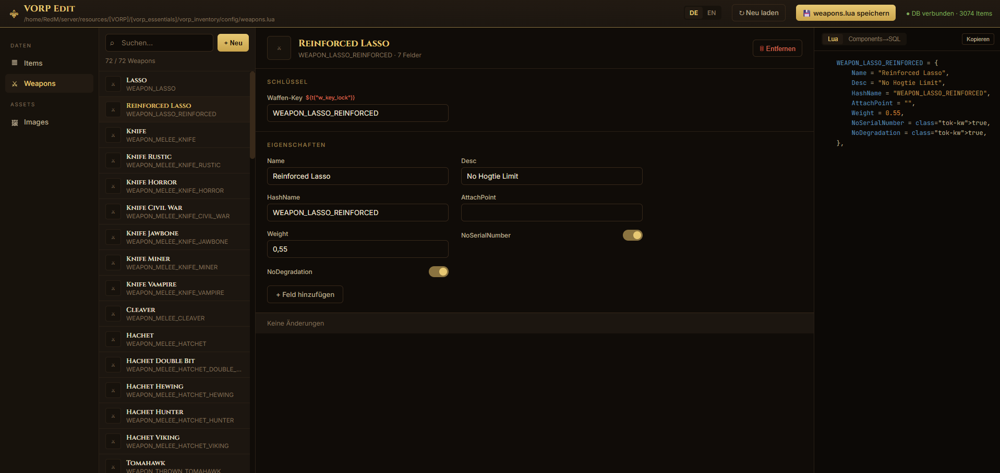
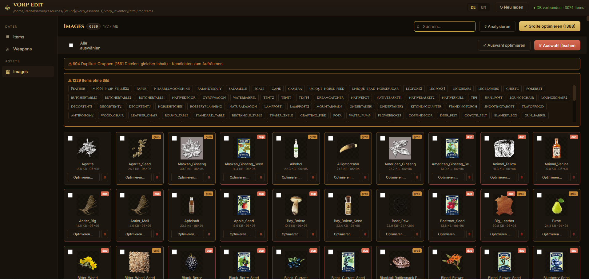

# VORP Edit

*Read this in: [English](README.md) · [Deutsch](README.de.md)*


A free, browser-based editor for **VORP** (RedM) inventory data — inspired by [oxEdit](https://github.com/Arius-Scripts/oxedit), but built for VORP instead of ox_inventory.

It connects directly to your VORP MySQL/MariaDB database and to your `vorp_inventory` resource files, so you can manage items, weapons and item icons from a web UI instead of editing SQL and Lua by hand.

---

## What it does

**Items** (from the `items` database table)
- Full edit form: label, weight, type, limit, group/rarity, degradation, durability, description, metadata and more
- Item icons shown inline
- Multi-select + bulk-edit: set one field on many items at once
- Duplicate detection (items sharing the same label get a `dup` badge)
- Live preview of the current item as **Lua / SQL / JSON**, with a copy button
- Create, edit and delete items

**Weapons** (from `vorp_inventory/config/weapons.lua`)
- Reads and writes the VORP `SHARED_DATA.WEAPONS` format
- Edit the simple fields (Name, Desc, Weight, HashName, flags, etc.)
- Nested `Components` tables are shown read-only and preserved exactly on save (nothing gets destroyed)
- A backup (`weapons.lua.bak`) is written automatically before every save
- Live **Lua** preview of the current weapon
- **Components → SQL** tab: generates `INSERT` statements so each weapon component becomes an item in the database, and inserts the missing ones with one click (required if you want components to be attachable from the inventory)

**Images** (from `vorp_inventory/html/img/items`)
- Gallery of all item icons with total size and live search
- **Analyze**: finds duplicate images (by content hash) and oversized ones
- **Optimize**: resize + re-encode PNGs with a before/after preview dialog (keeps transparency, only replaces when smaller)
- Bulk optimize / delete
- Shows which database items have no icon

---

## Requirements

- A web server with **PHP 7.4+** (8.x recommended) and the **`pdo_mysql`** extension
- The **GD** extension (`php-gd`) — only needed for the image optimizer; everything else works without it
- Your VORP database (MySQL/MariaDB)
- The web server must be able to **read** your `vorp_inventory` folder (and **write** to it if you want to save weapons or optimize images)

The simplest setup is a web server running on the **same machine** as your RedM server, so it can reach both the database and the resource files.

---

## Installation

### 1. Copy the files into your web root

Put everything into a single folder served by your web server (e.g. `htdocs/vorpedit/`, `/var/www/html/vorpedit/`). Keep this exact structure:

```
vorpedit/
├── index.html
├── app.js
├── config.php          <- all settings go here
└── api/
    ├── _lib.php
    ├── health.php
    ├── items.php
    ├── bulk.php
    ├── weapons.php
    ├── components.php
    ├── images.php
    └── image.php
```

> **Important:** the eight PHP files must stay inside the `api/` subfolder, and they must keep their `.php` extension. (Some download tools strip extensions — if you get 404 errors, this is usually why.)

### 2. Configure `config.php`

```php
<?php
return [
    'db_host' => '127.0.0.1',
    'db_port' => 3306,
    'db_name' => 'vorp',          // your VORP database name
    'db_user' => 'root',
    'db_pass' => 'your_password',

    // Optional write-protection (see Security below). Empty = off.
    'edit_token' => '',

    // Path to your vorp_inventory resource folder.
    // Needed for the Weapons and Images tabs.
    // Example Linux: '/home/server/resources/[vorp]/vorp_inventory'
    // Example Windows: 'C:/server/resources/vorp_inventory'
    'vorp_inventory_path' => '/path/to/vorp_inventory',
];
```

Tip: copy `config.example.php` to `config.php` and edit that — `config.php` is git-ignored so your password stays out of version control.

### 3. Open it in your browser

Go to `http://your-server/vorpedit/`.

Top-right should show **● DB connected · N Items** in green. If not, open `http://your-server/vorpedit/api/health.php` directly — it returns a JSON diagnostic showing exactly what's wrong (DB connection, paths, write permissions, GD availability).

---

## Permissions (Linux)

The Images and Weapons tabs need to **write** files. The web server user (often `www-data`) must be allowed to write to the relevant folders/files. If your RedM server created them as another user (e.g. `root`), saving will fail with a permission error.

Check `api/health.php` — if you see `"img_dir_writable": false` or `"weapons_writable": false`, fix it. Replace the paths with the ones shown by health.php (keep the quotes — the `[ ]` in VORP paths must be quoted in the shell):

```bash
# Give the web server user ownership of the writable targets:
sudo chown -R www-data:www-data "/path/to/vorp_inventory/html/img/items"
sudo chown www-data:www-data "/path/to/vorp_inventory/config/weapons.lua"

# Restart the web server:
sudo systemctl restart apache2     # or nginx / php-fpm
```

---

## Database notes

- The editor works with the standard VORP **V2 `items` schema** (columns: `item`, `label`, `limit`, `can_remove`, `type`, `usable`, `id`, `groupId`, `rarityId`, `metadata`, `desc`, `weight`, `degradation`, `useExpired`, `durability`, `instructions`).
- `item` is the **primary key**. It's locked after creation in the editor — renaming it would break the link to every stack players already hold in their inventory/loadout.
- `id` is assigned automatically as `MAX(id)+1` on insert.
- oxEdit-style fields that VORP doesn't have as columns (close, stack, consume, allowArmed, image, usetime, etc.) are merged into the `metadata` JSON column, so nothing is written to a non-existent column.
- **Weapon components:** some component names are longer than 50 characters. If you plan to insert components as items, widen the column once:
  ```sql
  ALTER TABLE `items` MODIFY `item` VARCHAR(64) NOT NULL;
  ```
  Without this, names over 50 chars are skipped (the editor tells you which).

### A note on caching

`vorp_inventory` caches item definitions when the resource starts. Changes you make here take effect in-game after `ensure vorp_inventory` (or a server restart), not instantly.

---

## Security

This tool can read and modify your live database and server files, so **do not expose it publicly without protection.**

- Set `edit_token` in `config.php` to a secret value, and put the same value in `app.js` (the `EDIT_TOKEN` constant near the top). Read access stays open; create/edit/delete/optimize require the token.
- Better still, put it behind HTTP basic-auth (`.htaccess`) or a reverse proxy / tunnel with access control, and ideally only reachable from your own network or VPN.
- Always test against a development database first — the tool writes to the real tables.

---

## Troubleshooting

| Symptom | Likely cause |
|---|---|
| `404` on `api/*.php` | PHP files not in `api/` folder, or lost their `.php` extension |
| PHP source shown as text | PHP not enabled/installed for that folder |
| "DB connection failed" | Wrong credentials in `config.php`, or DB not reachable from the web server |
| Weapons tab shows `0/0` | Wrong `vorp_inventory_path`, or `config/weapons.lua` not found |
| "0 KB saved" / optimize does nothing | Image folder not writable by the web server user (see Permissions) |
| Optimize button disabled | GD extension missing — install `php-gd` |
| `Data too long for column 'item'` | Component name over 50 chars — widen the column (see Database notes) |
| 404s for images like `Some Name.png` | These are database items with no matching icon file — harmless console noise |

Open `api/health.php` for a full diagnostic any time.

---

## How it works (brief)

A browser can't talk to MySQL directly, so the PHP files in `api/` act as the bridge:

```
Browser (index.html + app.js)  --HTTP/JSON-->  PHP (api/)  -->  MySQL  +  vorp_inventory files
```

Everything runs on your own server. No data is sent anywhere else.

---

## Credits

Inspired by [oxEdit](https://github.com/Arius-Scripts/oxedit) by Arius-Scripts (for ox_inventory). This is an independent reimplementation targeting the VORP framework with direct database access.

## Screenshots

### Items



### Weapons



### Images



Inspired by oxEdit by [https://github.com/Arius-Scripts](https://github.com/Arius-Scripts) (for ox_inventory). This is an independent reimplementation targeting the VORP framework with direct database access.
